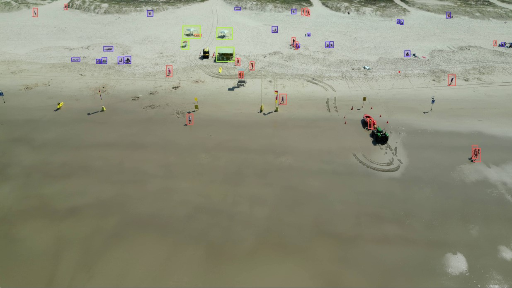

<div align="center">
<h2>Drone insights: unveiling beach usage through AI powered people counting</h2>

[**César Herrera**](https://experts.griffith.edu.au/30877-césar-herrera-acosta)<sup>1&dagger;*</sup> · [**Rod Connolly**]()<sup>1&dagger;</sup>  · [**Jasmine Rasmussen**]()<sup>1</sup> · [**Gerard McNamara**]()<sup>1</sup>  · [**Tom Murray**]()<sup>1</sup>  · [**Sebastian Lopez-Marcano**]()<sup>1</sup>  · [**Matt Moore**]()<sup>2</sup> · [**Fernando Alvarez**]()<sup>2</sup>

<sup>1</sup>Griffith University&emsp;&emsp;&emsp;&emsp;<sup>2</sup>City of Gold Coast&emsp;&emsp;&emsp;&emsp;<sup>

&dagger;project lead&emsp;*corresponding author
</div>

This work presents our work with drones and AI for assessing usage patterns of Gold Coast ocean beaches.



## Acknowledgement

We acknowledge that the work described here was carried out on the country of the Kombumerri peoples, and pay our respects to them as traditional custodians of the land. This research project was sponsored by the City of Gold Coast (the City) through a funding and collaboration agreement between the City and Griffith University. The City has provided data, including lifeguard data counts and overview to assist in the understanding of this research topic and its benefit to the industry partner. This research was supported by use of the Nectar Research Cloud and by FishID.  The Nectar Research Cloud is a collaborative Australian research platform supported by the NCRIS-funded Australian Research Data Commons (ARDC).

## Citation

If you find this project useful, please consider citing:

```bibtex

```
